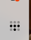
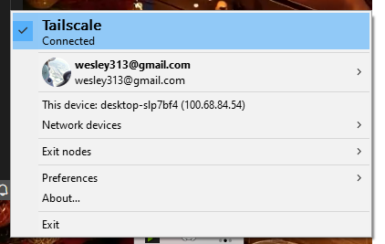
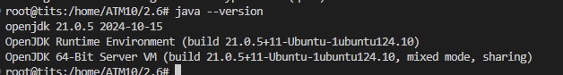
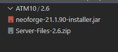

# All The Mods 10
---
## Install

1. Install Tailscale
    > Tailscale will replace NordVPN for us as a free way to "mesh" our computers together in a more secure way.
    - Download and Install [Tailscale for windows](https://pkgs.tailscale.com/stable/tailscale-setup-latest.exe)
    - Create [Account with Tailscale](https://tailscale.com/)
    - Login to Tailscale with the desktop app ( ) icon in taskbar
    - Go to https://login.tailscale.com/admin/invite/UWvK4TncfDh and accept the invite
    - Im not sure how this will appear for you guys, but you should be able to see my device (tits or 100.82.147.58)
    - In Tailscale you need to be "connected" to connect to the server. this wont effect anything else on your computer, but if you want, you can disconnect when not in use 
2. Download and Install ATM10 
    > Starting on Version 2.6

## Server Install Notes
- `sudo apt install openjdk-21-jdk`
    - 
- 
- `unzip Server-Files-2.6.zip`
- mv Server-Files-2.6.zip/* ATM10/2.6/
- `rm Server-Files-2.6.zip`
- `sudo java -jar neoforge-21.1.90-installer.jar --install-server`
